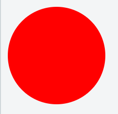
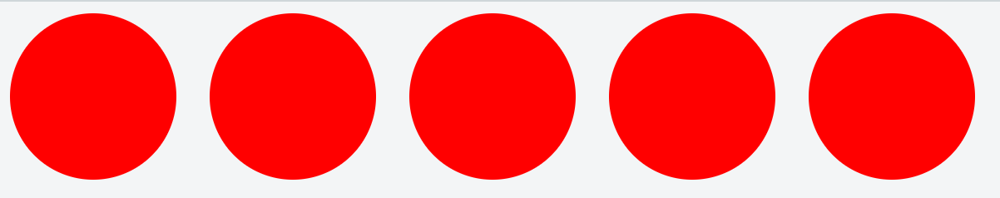
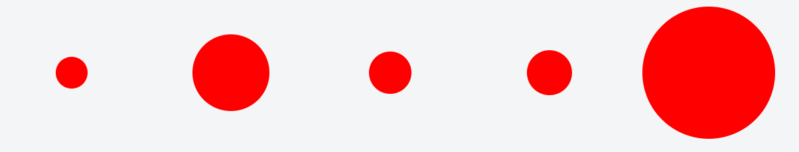

# MoJ - Data Science Hub - Introduction to D3

D3 ([Data Driven Documents](http://d3js.org)) is a javaScript library that enables users to create versatile web based visualisations. This is a very powerful library with a growing open-source community.

### Pros D3
- **It's free and open source** - there is a massive community of contributors to D3 and are tones of examples online that you can start from (rather than starting from scratch).
- **It's easy to distribute** - you do not need any costly software to run D3. As it is a JavaScript library all you need is a web browser to run your visualisations.
- **It's extremely versatile** - you can create some amazing visualisations that you wouldn't be able to create on any commonly used software tools used in government. 
- **It's built with a focus of data visualisation** - this enables us to build very impressive visualisations / models that work very well with changing data.

### Cons of D3
- **Versatility comes at a cost** - D3 has a very steep learning curve that often leaves you banging your head against walls and/or tables. Simple visualisations / dashboards take a long time to create relative to other tools like Excel, Tableau or R-Shiny.
- **Browser based** - web browsers aren't built with data manipulation in mind. Trying to create visualisations where there is a lot of data manipulation under the hood can get slow very quickly.

### When to use D3
- **This depends on you and your team** - We have personally found a place for D3 as a tool to use when what is required is a very bespoke visualisation that cannot be accomplished on other tools at our disposal (Excel, Tableau and R-Shiny). However, DWP have used D3 for their web based dashboards for their statistics (see link at bottom) and our own team are starting to create D3 dashboards when we need to distribute interactive data tools to people without any other visualisation software.
- **Accessibility** - If you need to distribute your work to multiple people across government or the public. D3 becomes a strong contender as it is just HTML, CSS and JavaScript (can be put into one single HTML file).
- **Google it** - There is a huge community that have probably already built the thing you want to create. If it already exists you can just copy the code, edit a few lines and go. Some good places to start looking are [bl.ocks.org](https://bl.ocks.org/) and [D3 Gallery](https://github.com/d3/d3/wiki/Gallery).

## Small intro into how D3 does it's thing
D3 is a large library with a lot of functions. Here is a simple example to show you some of the reasons why D3 is such a useful tool and what it's doing under the hood.

### Let's draw a circle
To start off let's start with how D3 works. It enables you to create, modify and delete different elements on you HTML page by using different selection calls. It does this by binding your data to each of these HTML elements - this is what makes D3 so powerful.

Before we bind our data lets make a simple circle. First we want to create the SVG element.
```javascript
svg = d3.select("body").append("svg");
```
"d3" is an object from the D3 library that contains all the different functions in the D3 library. In javascript, functions that belong to an object can be called in the following way: objectName.functionName(). D3 also allows you to do something called function chaining. The d3.select("body") call returns an object, that object has an append function which is then called immediately after. The code above is equivalent to:
```javascript
bodyFromHtml = d3.select("body");
svg = bodyFromHtml.append("svg");
```
The svg is the drawing element. We select the HTML body and add (append) a single svg drawing element. Before this line of javascript was called our HTML would look like a blank document. The code for html would look like this:
```html
<html>
    <body>
    </body>
</html>
```
And then after the javascript is called our HTML looks like this:
```html
<html>
    <body>
        <svg></svg>
    </body>
</html>
```
Our line of javascript code has added the SVG element into the body of our HTML.

Now that we have the drawing element, we can add drawings to it. Continuing on from our previous javascript code we now additional code.
```javascript
// Draw a single circle
d3.select("svg").append("circle")
.attr("r", 50)
.attr("cx", 50)
.attr("cy", 50)
.style("fill", "red");
```
Like we added the svg to the body we now add a circle to the SVG drawing element. We set it's radius (r), centre x location (cx) and centre y position (cy) are all set to 50 (pixels) using the .attr() function. We then also set the colour of the circle to red using the .style() function. Our HTML will now have a little circle in the top right hand corner.

The result:


### Binding Data
However the most useful part about D3 is the ability to add, select and delete elements to your HTML or SVG canvas where each element is bound to data. Let's add data to each of our circle elements. We'll use some data on the top 5 olympic gold medal winning countries in 2008:

|Country | gold |
|---|---|
|USA|125|
|CHN|74|
|RUS|43|
|AUS|31|
|GER|42|

First we create our data as an array of objects where each object represents a row in the table above. We also create some variables that we want to use for later.
```javascript 
// Create our array of medals data
var medalsData = [{Country: "AUS", gold: 31},
{Country: "CHN", gold: 74},
{Country: "GER", gold: 42},
{Country: "RUS", gold: 43},
{Country: "USA", gold: 125}];

// Let's also define some variables for our circle drawing
var maxRadius = 50;
var maxDiameter = maxRadius*2;
var offset = 20;
var maxGold = d3.max(medalsData, function(d){return d.gold;});
```

Now lets create some circles and bind them to our data (one circle per object or table row)
```javascript
// Add circles to SVG, bind circles to data
d3.select("svg")
.selectAll("circle").data(medalsData).enter()
.append("circle")
.attr("r", maxRadius)
.attr("cx", function(d,i){return maxRadius + i*(offset+maxDiameter);})
.attr("cy", maxRadius)
.style("fill","red");
```
The result:


Similar to the last example we selected the SVG and appended circles to it. However we do this slightly differently. In the following line: `.selectAll("circle").data(medalsData).enter()`. The first function call selects all circles within the SVG (at the instance this is called there are zero circle elements in the SVG). We then bind our array of data to these elements using `.data(medalsData)`. We then call the `.enter()` which only selects new HTML elements that need to be bound to the data (as there were no circle elements in SVG we have now selected 5 HTML elements - one for each element in the array). 

Next the last bits of code is the same as before (single circle example) we use the `.append()` call to create a circle (but this time one for each object (from medalsData) that is not currently bound to a circle element. We then use the `.attr()` and `.style()` to set the characteristics of the circles. The radius, centre-y position and fill are the same as before but we have now done something different for our centre-x position. So lets jump into that (first let's rewrite the `.attr()` call to be a bit more readable:

```javascript
// The first input to our attr function is the name of the attribute we want to change.
// The second input is what we want to change that attribute to.
.attr("cx",
    function(d,i){
        return maxRadius + i*(offset+maxDiameter);
    })
```
Instead of putting a static value for our circles centre-x position - we are putting in a function that returns a particular value based on two different inputs. The first input is 'd' this is each data element in the array (in this case the array is medalsData). The second input is 'i' this is the index number of the data (d) in the array. In this particular function, we don't use the data (d) in the array but it's position (i) in the array. The function is called for each circle element and sets it's centre-x position based on what data element it's bound to. This allows us to set each centre-x position for each circle to the appropriate amount of pixels.

*__Note__: `function(d,i){do some stuff...}` is commonly used in D3 as a way of passing through elements of data and returning a value based on each data point (d) and its position (i).*

We can use this type of function to change the radius of each circle, we use the same code as above but now instead of setting radius to the static value maxRadius we use a function to return the number of gold medals for each country _(scaled by maxRadius)_:

```javascript
// Add circles to SVG, bind circles to data and set radius and centre-x based on bound data.
d3.select("svg")
.selectAll("circle").data(medalsData).enter()
.append("circle")
.attr("r", function(d,i){return Math.floor(maxRadius*d.gold/maxGold);}) // Now radius is based on number of gold medals
.attr("cx", function(d,i){return maxRadius + i*(offset+maxDiameter);})
.attr("cy", maxRadius)
.style("fill","red");
```
The result:


### Why binding data is useful
*__Note__: This only works for objects in arrays. If our array only had values e.g. medalsData = [0, 10, 20, etc] the following example below and d3_demo.html would not work. This is due to how javaScript deals with passing values into functions rather than objects (for more info look into pass by value vs reference for JavaScript).*

To demonstrate this I am going to add two buttons our the HTML (using HTML and not D3).
```html
  <div id="options">
    <input name="updateDataButton" type="button" value="Update Data" onclick="updateData()" />
    <input name="updateCirclesButton" type="button" value="Update Circles" onclick="updateCircles()" />
  </div>
```
The first button will change the number of gold medals for each country. The second button will update the circles based on the data bound to them.

The only thing we now need to add to our previous JavaScript code are the two functions that are called when each button is pressed.
```javascript
updateData = function(){
    // loop through each object and change the value of gold
	medalsData.forEach(function(d){d.gold = Math.floor(Math.random() * maxGold)});
}

updateCircles = function() {
  // The each function is D3's version of the JavaScript forEach() function
  d3.select("svg").selectAll("circle").each(function(d, i) {
    d3.select(this).attr("r", Math.floor(maxRadius*d.gold/maxGold));
  })
}
```
The `.each()` function requires a function as input. It will apply that input function to each element in the selection. Our input function has two inputs, again, the first being the data bound to each individual element and the second being the index of that data. We set d (the bound data) to a new random number between `startNum` and `maxRadius`. The next line then sets the radius of the circle to the newly updated data (d). In order to do this we use the `this` javascript keyword.

`this` refers to whatever is calling our function - which in this instance (when using `.each()`) is the html element. So in summary this updateCircles() does the following:
1. selects all circles in the svg
2. gets each element (i.e. circle) in this selection to call a function
3. the function redraws the circles radius based on the data that is still stuck to it.

This is what makes D3 very useful - the data is "sticky" once it's bound the to elements it stays there so you can reference it later on. The update data button changes the data array itself. However because each HTML element still points to each object it's bound to means that you can refer to it whenever you want. This enables you to seperate your data manipulation and visualisations.  

As a final example we add click function to our circles. Giving each element a click or hover response is fairly easy. See the code below:
```javascript
// Add circles to SVG, bind circles to data
d3.select("svg")
.selectAll("circle").data(medalsData).enter()
.append("circle")
.attr("r", function(d,i){return d;}) // Now we simply return d the value in each element of the array
.attr("cx", function(d,i){return maxRadius + i*(offset+maxDiameter);})
.attr("cy", maxRadius)
.style("fill","red")
.on("click", updateSingleCircle);

```
This is an exact copy of the previous code to create our circles except with one additional function call on the last line (`.on()`). This function tells D3 that for each element (circle) we want it to react when a certain mouse event happens to it. In this case our event is a mouse click on the element and when this occurs the element will call a function we've named updateSingleCircle. All we need to do now is define our updateSingleCircle function:
```javascript
updateSingleCircle = function() {
  d3.select(this).each(function(d, i) {
    d.gold = Math.floor(Math.random() * 50);
    d3.select(this).attr("r", Math.floor(maxRadius * d.gold / maxGold));
  });
}
```
This function is very similar to updateCircles. Except it has an additional line of code that changes the data (d) it's bound to to a new random number.

The code can be found in this git repo named final_example.html. You'll notice that when messing with this html the transitions between changing circle radii is smooth. This is simply done by adding in `.transition()` before the `.attr("r", ...)` calls in the updateSingleCircle and and updateCircles functions.

#### Expanding This Idea
There is another HTML called d3_demo.html which expands on the ideas seen in section above. It allows you to randomly change all or parts of your data and then update your visualisation afterwards.

#### Other Useful links:
- Learning about HTML, CSS and JavaScript: https://www.w3schools.com/
- Understanding data binding / linking. Once you get your head around this D3 becomes a lot clearer!
-- https://bost.ocks.org/mike/join/
-- https://medium.com/@c_behrens/enter-update-exit-6cafc6014c36
-- https://square.github.io/intro-to-d3/data-binding/
- Charting libraries in JavaScript that use D3
-- [NVD3](http://nvd3.org/)
-- [C3](http://c3js.org/)
-- [Dimple](http://dimplejs.org/)
- Some examples of D3 being used in government
-- [at MoJ](https://moj-analytical-services.github.io/criminal_justice_statistics_sankey/)
-- [at DWP](https://femavis.herokuapp.com/index.html)
- An online tool to live demo / test your code [jsfiddle](https://jsfiddle.net)
-  This html document was created using [DILLENGER](http://dillinger.io/). _Dillinger is a cloud-enabled, mobile-ready, offline-storage, AngularJS powered HTML5 Markdown editor._
